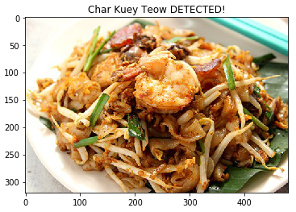
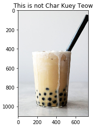
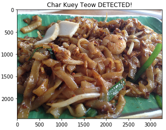
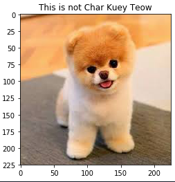

# Image classifier (Neural Network coded from scratch!) 

## Neural Network

Please head over to the introduction first: [**Neural Network 101**](https://github.com/timothylimyl/neutral_network)

## Results from classifier:

Purpose: Classifying an object image that you want from all other images.

In this classifier, I used the neural network that we have built to classify my favourite food, Char Kuey Teow. 

On a testing set of 170 different images, it had an accuracy of +75%. I think that is pretty good considering that all of the image datasets were collected solely from Google Images and no deep learning libraries were used. I have actually used the same datesets with Convolutional Neural Network (CNN) trained in PyTorch. Accuracy increased up to +85% which is a great improvement but not a surprising one. CNN is the default neural network for computer vision application!

## Utilising Neural Network for image classifier

Firstly, you can scrap images of a specific object off Google Images. Group the images you want to classify and have another group of random images. Tag the output of the images you want to identify as `1` which will act as the training signal for the Neural network. Images from Google are in RGB format (3-Channels). As we coded a Deep neural network here, the images has to be flatten into a vector. Note that the best way to classify images is to actually use a Convolutional Neural Network instead (this can be easily done using TensorFlow or any deep learning frameworks).

Try it for yourself!

### HOW TO USE IT ON YOUR COMPUTER?

* You only need to change the directory to your personal one *

1. Go to my google drive to download the datasets,[**HERE**](https://drive.google.com/open?id=12oIU2uCpO8LjkqC3WaQ1k1dB-WGCZmdg). The image I want to classify here is Char Kuey Teow (CKT) which is one of my favourite food, a Malaysia delicacy. A sample image:

2. Take note of your directory, go to resizing.py and resize the images.

3. After resizing the images, transfer the resized images into two different files (one for the image you want to detect and one for other images). You can search the images within the file (Go to the search bar -> type: resizing_new) All your resized image will appear, now transfer it to a new file.

4. Now you can run the NN_Final.py script and it will compute all of the parameters required. Remember to change the directory of the input data to your resized image file!

5. Try it out with your own images or use the images in test_your_images to see whether is the AI working! Run test_your_image.py after you are finished running NN_Final.py

6. Tune the NN_Final yourself and see whether can you get better testing accuracy!

Note: You will need to have Pillow, NumPy, OpenCV , matplotlib libraries installed on your computer.

